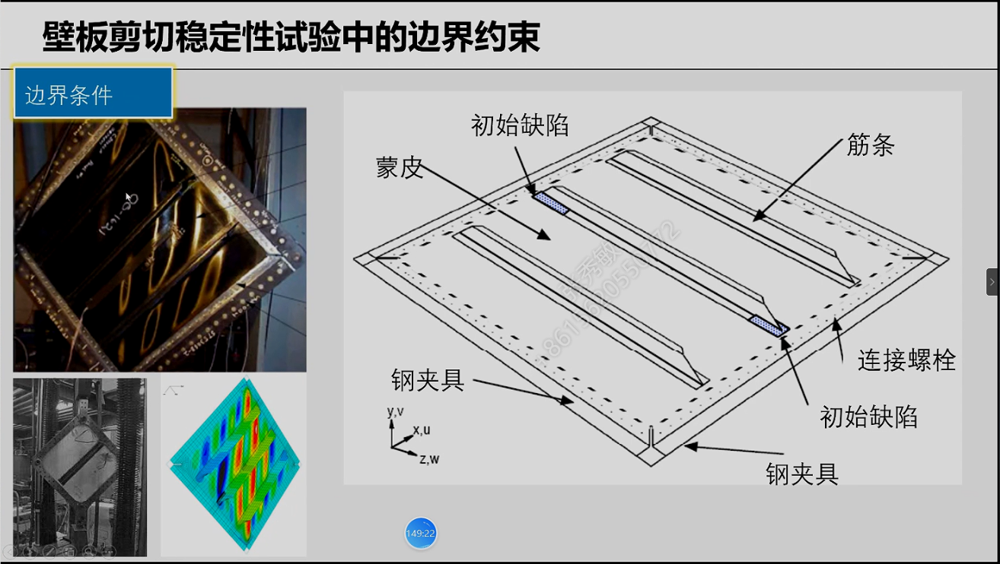

计划共有13章，49节内容，主要讲述复合材料力学基础、层压板、夹层板的基本建模方法，壳单元，连续壳实体单元建模，离散增强建模，加筋板建模、复杂曲面建模、显式分析建模、常见复合材料建模错误分析等。

<!--more-->

### 复合材料通用建模流程

 复合材料建模顺序

各项异性材料 界面属性，

### abaqus常用材料本构介绍

中间的矩阵叫柔度矩阵

各向异性材料

近似的认为G13等于G23等于E1 E2

管客服要abaqus材料库

经典的建模方法效率比较低，但是在子程序的建模以及显式分析中的实体单元只能用经典建模方法

### 壳单元横向剪切变形分析

经典层合板理论

abaqus一阶横向剪切变形理论

复合材料的快捷建模

## 显式建模

1、材料模型中添加密度

2、建立Dynamic/explicit分析步

3、修改场输出及历史输出频率

4.修改加载幅值曲线

修改加载速率

网格类型设置为explicit

### 建模模型匹配

### 离散增强和加筋板建模

加筋板的三角填充区

tie和cohesion tie

加筋板的稳定性分析

对称的变形，输出设置

一阶，二阶和三阶失稳，线性特征值屈曲

 

·	

#### 解决abaqus导入文件中文乱码问题

hasin失效判据设置，在machinical里选 hasin damage

用于爆炸分析等问题

参数学习

.psf文件是参数学习脚本文件

